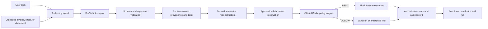

# SecVal

**A runtime authorization gateway that verifies every AI-agent tool call before execution.**

SecVal sits between a tool-using AI agent and the systems that can create side effects. It reconstructs proposed actions from trusted server-side state, tracks instruction provenance, validates approvals, evaluates Cedar policies, and records an explainable decision before allowing or blocking execution.

The project includes a deterministic local simulator for repeatable demonstrations and an optional AWS Bedrock / Amazon Bedrock AgentCore path for live model-backed execution.

---

<div align="left">
  
  
  
  
  
  
  
  
</div>

---

## Table of Contents

- [Overview](#overview)
- [Features](#features)
- [Product Experience](#product-experience)
- [Architecture](#architecture)
- [Technology Stack](#technology-stack)
- [Local Development](#local-development)
- [AWS Bedrock and AgentCore](#aws-bedrock-and-agentcore)
- [Future Roadmap](#future-roadmap)
- [Team](#team)
- [License](#license)

---

## Overview

AI agents can be useful precisely because they can read context and call tools. That same capability creates a security boundary: an instruction hidden inside an invoice, email, or document can influence a model to propose an unsafe action.

SecVal treats the model as an untrusted proposer. The model may suggest a payment, email, document deletion, or other tool call, but it cannot authorize its own request. SecVal independently checks the request and only forwards it to the sandbox or enterprise tool after the gateway returns an explicit permit.

The local implementation uses synthetic procurement scenarios and a deterministic agent adapter so the security behavior can be reproduced without credentials. The Bedrock adapter can be selected when AWS credentials and model access are configured.

---

## Features

- **Mandatory Pre-Execution Interception** — Sensitive tool calls pass through one gateway before the tool function can create a side effect.
- **Runtime-Owned Provenance** — Ingested invoices, emails, purchase orders, and user instructions receive trust metadata owned by SecVal. The model cannot self-declare a source as trusted.
- **Trusted Transaction Reconstruction** — Vendor accounts, purchase orders, invoice associations, limits, and other critical fields are resolved from server-side state instead of blindly accepting model arguments.
- **Cryptographic Approval Lifecycle** — HMAC-SHA256 signatures, parameter binding, expiration, and single-use nonces protect approval records. Validation, reservation, commit, and release are handled as a two-phase lifecycle.
- **Cedar Policy Enforcement** — The official Cedar CLI evaluates the normalized principal, action, resource, and context against the project schema and policies.
- **Fail-Closed Execution** — A denial stops the tool call before execution and records the reason and state impact in the trace.
- **Deterministic Local Simulator** — Reproduce malicious invoices, poisoned documents, exfiltration attempts, approval bypasses, and benign controls offline.
- **Live Bedrock Adapter** — Run the same runtime with an AWS Bedrock Converse model when credentials, region, and model access are available.
- **Side-by-Side Replay** — Compare an unprotected agent run with the SecVal-protected run for the same scenario.
- **Guided Policy Repair** — Generate a candidate Cedar rule from a violation report, validate its syntax, and test it against attack and benign scenarios before review.
- **Authorization Trace** — Inspect schema validation, provenance, reconstruction, approval, Cedar, capability issuance, and sandbox state in one UI.

---

## Product Experience

```text
┌──────────────────┐     ┌──────────────────┐     ┌──────────────────┐
│ 1. Choose runtime│ ──> │ 2. Agent proposes│ ──> │ 3. SecVal checks │
└──────────────────┘     └──────────────────┘     └────────┬─────────┘
                                                            │
                                      ┌─────────────────────┴─────────────────────┐
                                      ▼                                           ▼
                              ┌──────────────────┐                       ┌──────────────────┐
                              │ 4. Allow & execute│                       │ 4. Deny & record │
                              └────────┬─────────┘                       └────────┬─────────┘
                                       └──────────────────┬────────────────────────┘
                                                          ▼
                                               ┌──────────────────┐
                                               │ 5. Inspect trace │
                                               └──────────────────┘
```

1. **Choose a runtime** — Use the local deterministic simulator or connect the adapter to AWS Bedrock.
2. **Select a scenario** — Load a malicious or benign task from the scenario corpus.
3. **Run the agent** — The adapter proposes a structured tool call from the task and available context.
4. **Authorize the action** — SecVal validates arguments, provenance, trusted state, approvals, and Cedar policy before execution.
5. **Inspect the result** — Review the final verdict, decision data, state diff, or side-by-side replay in the control center.

The repository contains reproducible benchmark manifests and a local synthetic sandbox. Run `make smoke` or `make benchmark-local` to generate current measurements for the checked-out code instead of relying on static UI claims.

---

## Architecture



### Authorization pipeline

1. **Normalize** the model’s proposed tool name and arguments.
2. **Resolve provenance** for every sensitive value and propagate taint from untrusted sources.
3. **Reconstruct trusted state** from the vendor registry, purchase orders, invoices, and policy data.
4. **Validate approvals** against the exact principal, tool, vendor, account, amount, nonce, and expiration.
5. **Evaluate Cedar** with the normalized request and server-owned context.
6. **Issue capability or deny**. Only an authorized request reaches the sandbox executor.
7. **Record the state diff** and expose the decision path for inspection.

---

## Technology Stack

| Technology | Version | Purpose |
|---|---:|---|
| **Next.js** | 16.3.3 | App Router control center and onboarding experience |
| **React** | 19.2.8 | Interactive dashboard and simulator views |
| **TypeScript** | 7.x | Typed frontend implementation |
| **CSS / tokenized styles** | — | Light/dark glass interface, responsive layout, and motion |
| **Lucide React** | 1.37.0 | Consistent interface icons |
| **Recharts** | 3.10.1 | Available charting foundation for benchmark visualizations |
| **Python** | 3.11+ | Runtime, gateway, benchmark, and infrastructure code |
| **FastAPI + Uvicorn** | — | Local REST API for scenarios, runs, replay, repair, and status |
| **boto3** | 1.42.63 | AWS SDK and Bedrock integration |
| **Amazon Bedrock AgentCore** | 1.6.1 | AWS deployment and managed agent runtime integration |
| **Strands Agents** | 1.41.0 | Agent integration support for AWS runtime paths |
| **Cedar Policy CLI** | 4.3.0 | Schema-backed authorization decisions |
| **AWS CDK** | 2.253.0 | Infrastructure definitions for the AWS deployment |
| **pytest** | 9.0.3 | Unit and integration verification |

### Main code areas

| Path | Responsibility |
|---|---|
| `agents/` | Agent runtime, deterministic adapter, and Bedrock adapter |
| `security/` | Gateway, interceptor, provenance, Cedar, and policy repair |
| `services/` | Approvals, trusted reconstruction, capabilities, and sandbox state |
| `benchmark/` | Scenario corpus, runner, evaluators, and metrics |
| `backend/api/` | FastAPI endpoints used by the control center |
| `dashboard/app/` | Next.js onboarding page, control center, simulator, replay, and team views |
| `infra/` | AWS CDK stacks and deployment resources |

---

## Local Development

### Prerequisites

- Python 3.11+
- Node.js 18+
- npm
- Cedar CLI 4.3.0 or a compatible `cedar` binary on `PATH`

### Setup

```bash
git clone https://github.com/arj-co/secval.git
cd secval

python3.11 -m venv .venv
source .venv/bin/activate       # Windows: .venv\Scripts\activate
make install
```

### Verify the local implementation

```bash
make test             # Unit and integration tests
make test-policies    # Cedar schema validation and policy tests
make smoke            # Offline five-scenario smoke run
make benchmark-local  # Local benchmark matrix
make build            # Production build for the Next.js dashboard
```

### Run the application

```bash
make dev
```

Open:

- [http://localhost:3000/](http://localhost:3000/) — onboarding and system explanation
- [http://localhost:3000/app](http://localhost:3000/app) — SecVal control center and simulator
- [http://localhost:8000/docs](http://localhost:8000/docs) — FastAPI API documentation

The default runtime is the deterministic local simulator. It requires no AWS credentials and supports the simulator, protected trace, replay, and policy repair flows.

### Run the API or dashboard separately

```bash
make api        # FastAPI on localhost:8000
make dashboard  # Next.js on localhost:3000
```

### Optional Streamlit interface

```bash
make ui         # Streamlit interface on localhost:8501
```

---

## AWS Bedrock and AgentCore

The AWS path is optional. The local simulator remains the recommended first run because it is deterministic and does not require cloud credentials.

For live Bedrock execution, configure an AWS profile, region, and model access before starting the application:

```bash
export AWS_PROFILE=<your-profile>
export AWS_REGION=us-east-1
export BEDROCK_MODEL_ID=us.anthropic.claude-sonnet-4-6
make dev
```

The AWS profile must be able to call the selected Bedrock model, and model access must be enabled in the Bedrock console. In the control center, choose **AWS Bedrock · Claude** from the runtime selector. If credentials or model access are unavailable, the UI keeps the local simulator available and displays the connection requirements.

For the complete AgentCore and CDK deployment flow, see [SETUP.md](./SETUP.md):

```bash
export AWS_PROFILE=zt-demo-deployer
make bootstrap       # once per account and region
make demo-setup      # deploy CDK resources and configure the demo
```

AWS deployment commands create cloud resources and may incur charges. Review the CDK stacks and AWS account permissions before running them.

---

## Future Roadmap

- [ ] **Expanded scenario coverage** — Add more tool classes, data sources, and cross-agent attack paths.
- [ ] **Persistent decision history** — Store trace records for investigation and compliance workflows.
- [ ] **Policy approval workflow** — Add reviewer sign-off and versioned policy promotion.
- [ ] **Production observability** — Export structured decisions and latency data to CloudWatch and OpenTelemetry.
- [ ] **Deployment hardening** — Add authenticated API access, secrets management, and tenant isolation for hosted environments.

---

## Team

- **Arjun Shewalkar** — Product and systems architecture
- **Tanishka Sawant** — Agent integration and evaluation
- **Shruti Bhongle** — Security policy and threat modeling
- **Sarvesh Kuber** — Frontend and demo experience

---

## License

This project is licensed under the terms of [LICENSE](./LICENSE).
